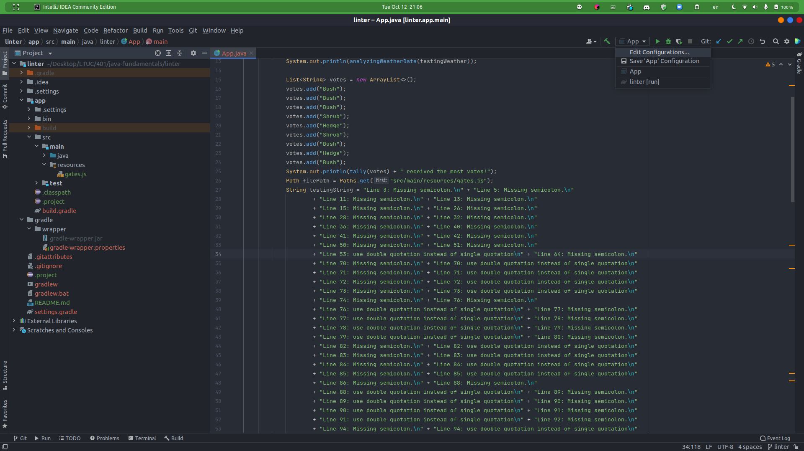
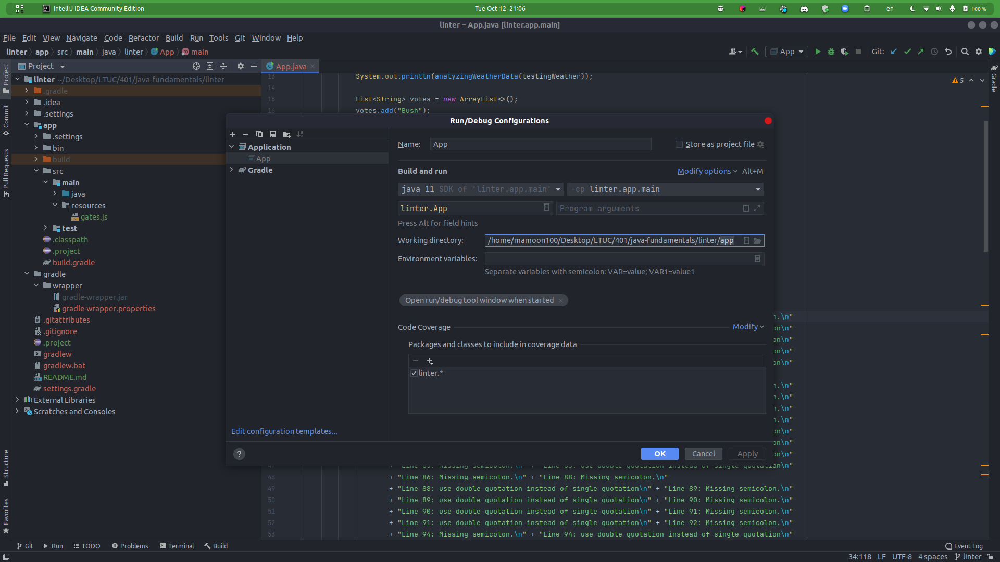

# Linter

This file contain the third lab of java401d5 course.

and it contain:

1. **analyzingWeatherData** a method that takes a two dimensional array of weather data and returns a formatted string containing the lowest, highest, and never seen temperature in the whole dataset.

   - **analyzingWeatherDataTest** a test method for analyzingWeatherData method and make sure the return string is formatted properly.

2. **tally** a method that takes List of Arrays of Names and return the most rebated name in the List.

   - **tallyTest** a test method for tally method and make sure the returned name is correct.

3. **javaScriptLinter** a method that will take the path of java script file and return a string of the errors in the file formatted in line number and the error name.
   - **javaScriptLinterTest** a test method for javaScriptLinter method and make sure the returned string is formatted properly and it's correct in error shown.

## Usage

- running the test:
  `$ gradle test`

- running the whole project from terminal:
  `$ gradle run`

- running and testing your file for error run
  `$ gradle run --args="yourFilePath"`

> **youFilePath** is the path of your file that you want to test knowing that the root folder for this project is the app directory (i.e if you want to execute the file in the test resources folder you should write  
> `$ gradle run --args="src/test/resources/folderName.js"`
> )

## knowing issue

Sometimes when you try to run the project from intellej idea you will have an error in the folder name, to avoid this error you should do the following:

1. open intellej idea and go to the App in the main folder
2. click on the down arrow beside the green run arrow in the top .
3. click Edit configuration and change the project directory by adding /app to the end of the path.

